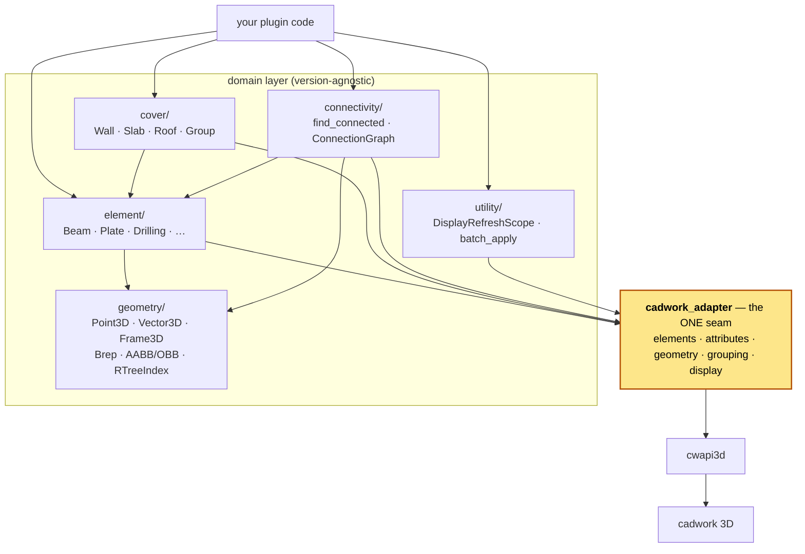

# pycadwork

**An object-oriented layer over [cwapi3d](https://pypi.org/project/cwapi3d/), the cadwork 3D Python API.**

`pycadwork` turns cadwork's flat, ID-and-controller-based API into a small,
typed, polymorphic object model. Instead of passing integer element IDs through
free functions on a dozen `*_controller` modules, you work with `Beam`, `Plate`,
`Drilling`, `Wall`, `Slab`, and `Roof` objects that carry their own geometry,
attributes, and behaviour — while every call to cadwork is funnelled through a
single, version-isolated seam.

```python
from pycadwork import Beam, Point3D, RectSection, AxisPoints

beam = Beam.create_rectangular(
    RectSection(width=120.0, height=240.0),
    AxisPoints(Point3D(0, 0, 0), Point3D(3000, 0, 0), Point3D(0, 0, 1)),
)
beam.attrs.material_name = "Pine"  # symmetric read/write properties
beam.attrs.group = "frame"

print(beam.geometry.length)   # live query against the model
print(beam.geometry.volume)
print(beam.cross_section)     # CrossSection.RECTANGULAR

beam.geometry.width = 100.0  # writes the real dimension back to the model
```

---

## Why this exists

cwapi3d is a thin binding over cadwork's C++ API. It is powerful but procedural:
everything is an `int` element ID, and behaviour lives in stateless controllers
(`element_controller`, `attribute_controller`, `geometry_controller`, …). Real
plugins end up threading raw IDs through helper functions and re-deriving an
element's "kind" by calling a battery of `is_*` predicates by hand.

`pycadwork` gives that surface an object model with four design commitments:

1. **One seam to cwapi3d.** Every cadwork call goes through
   `pycadwork.cadwork_adapter`. The rest of the package never imports `cadwork`
   or any `*_controller`. This isolates the entire codebase from any specific
   cwapi3d version — when the API moves, only the adapter changes.
2. **A uniform `Element` model.** Every wrapper inherits from one `Element` base.
   Aggregate APIs return `list[Element]`; you narrow by type with a generic
   helper (`group.members_of(Beam)`), never a `.beams` / `.plates` accessor.
3. **Real geometry value-types.** `Point3D`, `Vector3D`, `Frame3D`, bounding
   boxes, B-reps and a spatial index — proper objects with operators and
   methods, not bare tuples.
4. **Testable without cadwork.** The seam means the whole library runs against
   an in-memory fake. The suite (445 tests) needs no running cadwork process.

---

## Installation

`pycadwork` targets **Python 3.14+** and is managed with [uv](https://docs.astral.sh/uv/).

```bash
uv sync                 # install the library + dev dependencies
uv sync --extra cadwork # include the cwapi3d runtime dependency explicitly
```

Or with pip:

```bash
pip install -e .
```

> **Note** — `cwapi3d` only does real work inside a running cadwork 3D process.
> Outside cadwork (CI, local dev, tests) the library still imports and runs; you
> just swap the adapter for the in-memory fake (see [Testing](#testing)).

---

## Architecture



Everything above the seam is agnostic of any specific cwapi3d version. The
adapter is a facade of five responsibility-scoped sub-adapters; the only stable
types crossing the seam are the aliases and value objects in
`cadwork_adapter/types.py` (`ElementId`, `ElementTypeSnapshot`, `GroupingMode`,
`CoverKind`, …).

### Package layout

| Module                      | Responsibility                                                                                                                                                                 |
|-----------------------------|--------------------------------------------------------------------------------------------------------------------------------------------------------------------------------|
| `pycadwork.cadwork_adapter` | The single seam to cwapi3d. Five sub-adapters (`elements`, `attributes`, `geometry`, `grouping`, `display`) plus the stable types crossing it.                                 |
| `pycadwork.element`         | Typed element wrappers — `Beam`, `Plate`, `Drilling`, `Node`, `Line`, `Surface`, `Opening`, `ConnectorAxis`, `AuxiliaryElement`, `CircularMep`, `RectangularMep` — plus the `Container` aggregate, the dispatch registry, and `from_id`. |
| `pycadwork.element.cover`   | Cover objects (`Wall`, `Slab`, `Roof`), the grouping-driven `Aggregate` base, `Group`, the fluent `CoverBuilder`, and `discover_covers`.                                       |
| `pycadwork.geometry`        | Pure geometry value-types: `Point3D`, `Vector3D`, `Frame3D`, `Plane3D`, `Line3D`, `Segment3D`, `Loop`, `Face`, `Brep`, AABB/OBB, the R-tree spatial index, and creation specs. |
| `pycadwork.connectivity`    | `find_connected` and `build_connection_graph` / `ConnectionGraph` — which elements touch or intersect, and the whole-model contact graph.                                      |
| `pycadwork.utility`         | Cross-cutting helpers: `DisplayRefreshScope`, `batch_apply`, and `auto_*` decorators.                                                                                          |

The top-level namespace re-exports the full public surface, so you can write
`from pycadwork import Beam, Wall, CoverBuilder, Point3D` without knowing the
submodule layout.

---

## The element model

Every concrete wrapper inherits from a single `Element` base. An `Element` is a
**live view over a cadwork ID** — reads are queries against the active backend,
not cached snapshots. It aggregates two component objects to keep its own
surface small:

- **`element.attrs`** — an `Attributes` view: `name`, `group`, `subgroup`,
  `comment`, `material_name`, `sku`, `production_number`, `part_number`,
  `cadwork_guid`, `additional_data`, `assembly_number`, and indexed
  `user_attribute(i)`. Each is a read/write property (`attrs.group = "frame"`),
  except read-only `cadwork_guid` and the indexed `user_attribute(i)` /
  `set_user_attribute(i, v)` pair, which stay methods.
- **`element.geometry`** — a `Geometry` view (narrowed per subclass) exposing
  `volume`, `weight`, `center_of_gravity`, `aabb`, `brep`, and — for linear and
  oriented elements — `start_point` / `end_point`, `frame`, `length` / `width` /
  `height`, `axis_points`, `axis_frame`, `obb`, and `thickness`.

```python
beam.attrs.name              # -> str
beam.attrs.material_name = "Pine"  # write-back via the matching setter property
beam.geometry.center_of_gravity   # -> Point3D
beam.geometry.frame               # -> Frame3D
beam.geometry.obb                 # -> OrientedBoundingBox
```

### Element types

| Wrapper | cadwork concept | Geometry component |
| --- | --- | --- |
| `Beam` | rectangular / circular / square / polygon linear member | `LinearGeometry` |
| `Plate` | panel (flat board/sheet) | `OrientedGeometry` (adds `thickness`) |
| `Drilling` | drilling axis | `LinearGeometry` |
| `ConnectorAxis` | connector axis | `LinearGeometry` |
| `Line` | line element | `LinearGeometry` |
| `Node` | positioned point | `NodeGeometry` (adds `position`) |
| `Surface` | surface element | `Geometry` |
| `Opening` | opening | — |
| `AuxiliaryElement` | auxiliary element | — |
| `Wall` / `Slab` / `Roof` | cover objects (aggregates) | see below |

### Uniform typing — no per-type accessors

Aggregate APIs always return `list[Element]`. To get a specific type, use the
generic, type-safe narrowing helper rather than a bespoke accessor:

```python
beams = group.members_of(Beam)   # list[Beam]
plates = wall.children_of(Plate) # list[Plate]
```

This means adding a new element subclass never requires adding a new accessor
anywhere — the polymorphic base plus `members_of(cls)` covers it.

### Wrapping existing elements: `from_id`

To wrap an ID that already exists in the model, use `from_id`. It reads the
element's type once and dispatches to the most specific subclass via a
**declarative priority registry**:

```python
from pycadwork import from_id

elem = from_id(1234)   # -> Beam, Plate, Wall, … whichever matches
```

Each wrapper registers itself at class-definition time with a predicate over an
`ElementTypeSnapshot` and a *priority band* (`AGGREGATE` < `SPECIAL` <
`PRIMITIVE` < `GEOMETRIC`). Cover objects beat primitives because a wall also
satisfies `is_beam`. Registering a custom subclass is one decorator:

```python
from pycadwork import register_element
from pycadwork.element.registry import PRIMITIVE

@register_element(lambda s: s.is_beam, priority=PRIMITIVE)
class MyBeam(Beam):
    ...
```

---

## Cover objects: walls, slabs, roofs

In cadwork, a wall/floor/roof and its members are **not** linked by a container
API — they share a `group` (or `subgroup`) value, and which one is the
project-wide setting read from `get_element_grouping_type()`. `pycadwork` models
this faithfully:

- `Wall`, `Slab`, `Roof` are `Aggregate` subclasses — themselves real cadwork
  elements flagged with a `CoverKind` (`FRAMED_WALL`, `SOLID_FLOOR`, …).
- `Group` is a value-typed view over everyone sharing a grouping key, reading
  the active mode live so the same code adapts when the project setting changes.
- An aggregate's `children` are its siblings in the group, minus itself.

```python
from pycadwork import Wall, Beam, Plate, CoverKind, CoverBuilder, cadwork

# children are polymorphic; narrow by type when you need to
wall.children            # list[Element]
wall.children_of(Beam)   # list[Beam]
wall.kind                # CoverKind.FRAMED_WALL

# imperative attach / detach
wall.add_child(beam)
wall.add_children([beam, plate])
wall.replace_children(new_members)
wall.remove_child(beam)
```

### Assembling covers with `CoverBuilder`

The builder takes a bunch of elements, lets you set assembly options fluently,
then `build()` returns the assembled covers as `list[Aggregate]`. The
`aggregate_by_grouping` strategy buckets the elements by their active
`group`/`subgroup` key and types each bucket holding a wall/floor/roof element:

```python
from pycadwork import CoverBuilder, Wall, Document

# every cover among the active elements, typed Wall / Slab / Roof
covers = CoverBuilder(Document.active()).aggregate_by_grouping().build()

# narrow the result to one cover family
walls = CoverBuilder(elements).aggregate_by_grouping().only(Wall).build()
```

The builder offers multiple assembly strategies by design. To *attach* children
to a cover, use the imperative `Aggregate.add_child` / `add_children` directly.

### Discovering covers in a model

`discover_covers` scans the model (or a custom set of IDs), buckets elements by
their grouping key, and returns one typed aggregate per bucket that contains a
wall/floor/roof parent. It's a **module-level free function**, not a classmethod:

```python
from pycadwork import discover_covers

for cover in discover_covers():        # list[Aggregate] (Wall/Slab/Roof)
    print(cover, len(cover.children))
```

---

## Containers and MEP

A `Container` is an aggregate like a cover — it owns a set of typed children
through the same uniform `children` / `children_of(cls)` surface — but the link
is *real containment*, not grouping. A cover's members share a `group` /
`subgroup` value; a container's members are wired to it in the model, so a
container reads its contents with cadwork's containment API and any element can
report its owning container. `Container` therefore does **not** inherit the
grouping-driven cover `Aggregate`.

```python
from pycadwork import Container, discover_containers, parent_container

# Build a container from elements using a configured cadwork standard.
c = Container.create_from_standard([beam_a, beam_b], "C1", "MyContainerStandard")

c.children                      # list[Element], wrapped to their typed classes
c.children_of(Beam)             # list[Beam]
c.add_child(beam_c)             # mutate membership (add / remove / replace)
c.remove_child(beam_a)
c.replace_children([beam_c])

parent_container(beam_c)        # -> Container | None  (free function, like discover_*)

for container in discover_containers():
    print(container, len(container.children))
```

`CircularMep` (a pipe) and `RectangularMep` (a duct) are ordinary leaf elements,
path-anchored like `Beam`/`Drilling`. A circular run carries a `diameter`; a
rectangular run carries `width` and `depth`:

```python
from pycadwork import CircularMep, RectangularMep, Point3D

pipe = CircularMep.create(80.0, [Point3D(0, 0, 0), Point3D(0, 0, 3000)])
duct = RectangularMep.create(200.0, 100.0, [Point3D(0, 0, 0), Point3D(0, 0, 3000)])
pipe.diameter                   # 80.0
```

---

## Geometry

A self-contained geometry layer of value-types — usable on its own, with no
cadwork process involved:

- **`Point3D`** — a position. Supports `Point + Vector → Point`,
  `Point − Point → Vector`, epsilon-based equality, and `distance_to`.
- **`Vector3D`** — magnitude/direction with the usual vector algebra.
- **`Frame3D`** — an origin plus orthonormal axes (a local coordinate frame).
- **`Plane3D`**, **`Line3D`**, **`Segment3D`**, **`Loop`**, **`Face`** — the
  classic primitives.
- **`Brep`** — a boundary representation built from cadwork facet lists.
- **`AxisAlignedBoundingBox`** / **`OrientedBoundingBox`** — with
  `expanded(tolerance)` for tolerance-grown queries.
- **`RTreeIndex3D`** (a `SpatialIndex3D`) — an R-tree over element AABBs for fast
  spatial pruning, backed by [`rtree`](https://pypi.org/project/Rtree/).
- **Creation specs** — `RectSection`, `PanelSection`, `AxisPoints`, `AxisFrame`,
  `Segment` — frozen parameter objects bundling the arguments that flow into
  `create_*` calls, consumed identically by the domain classmethods, the
  adapter, and the fake.

```python
from pycadwork import Point3D, Vector3D

a = Point3D(0, 0, 0)
b = Point3D(3, 4, 0)
displacement = b - a          # Vector3D(3, 4, 0)
moved = a + Vector3D(0, 0, 1) # Point3D(0, 0, 1)
a.distance_to(b)              # 5.0
```

---

## Connectivity

Find which elements touch or intersect, or build the whole-model contact graph.
Both decide contact **geometrically by default** (tightest bounding region grown
by a tolerance, accelerated by the spatial index) and both accept a custom
`connects(a, b) -> bool` predicate.

```python
from pycadwork import find_connected, build_connection_graph

# everything touching one element
neighbours = find_connected(beam, tolerance=1.0)

# the whole-model graph
graph = build_connection_graph()         # ConnectionGraph
graph.neighbors(beam)                     # adjacency
graph.connected_components()              # touching sub-assemblies
graph.component_of(beam)                  # the sub-assembly containing `beam`

# custom contact rule
same_group = lambda a, b: a.attrs.group == b.attrs.group
g = build_connection_graph(connects=same_group)
```

`ConnectionGraph` is an undirected, in-memory snapshot of contacts (nodes are
`Element`s, hashable by `(type, id)`); it does not stay live as the model
changes. Like everything else it exposes adjacency only — filter by type
yourself when you need to.

---

## Utilities

### Suppressing display refresh during bulk work

cadwork repaints after every element mutation. For bulk operations that costs
more than the work itself. `DisplayRefreshScope` drives the seam's
disable / recreate / enable triple, exception-safe (refresh is always
re-enabled; recreate is skipped if the block raised):

```python
from pycadwork import DisplayRefreshScope

with DisplayRefreshScope() as scope:
    beams = [Beam.create_rectangular(sec, ax) for sec, ax in specs]
    scope.track(beams)        # recreated once, on exit
```

As decorators: `@DisplayRefreshScope()` / `@auto_recreate` (create-and-track in
one call) / `@suppressed_display` (suppress refresh, no recreate — for
attribute-only mutations that don't change geometry).

### Batch attribute writes

```python
from pycadwork import batch_apply

batch_apply(beams, group="frame", material_name="Pine")
# one adapter call per attribute, instead of one per element
```

Unknown attribute names raise `TypeError` so typos surface at the call site.

---

## Testing

The single-seam design is what makes the library testable without cadwork. A
`conftest.py` fixture swaps the live sub-adapters for an in-memory
`FakeCadworkAdapter` on every test, so the full suite runs anywhere:

```bash
uv run pytest                       # full suite (445 tests, no cadwork needed)
uv run pytest tests/element         # one area
uv run pytest -k connectivity       # by keyword
```

When you add a cadwork call, the recipe is symmetric: add it to the right
sub-adapter in `cadwork_adapter/`, mirror it on the matching fake in
`tests/_fakes/cadwork_adapter.py`, then expose it on the relevant wrapper.

---

## Design principles

These run through the whole codebase and are worth knowing before you extend it:

- **Version isolation.** `pycadwork` stays agnostic of any specific cwapi3d
  version; all cwapi3d calls go through the one adapter seam. Nothing outside
  `cadwork_adapter` imports `cadwork` or a `*_controller`.
- **Uniform element API.** Aggregates return `list[Element]`. There are no
  `.beams` / `.plates` / `.drillings` accessors — a common polymorphic base plus
  `members_of(cls)` / `children_of(cls)` covers every case.
- **Cover objects link by grouping, not containment.** Members share a
  `group`/`subgroup` value; the active mode comes from
  `get_element_grouping_type()`, read at call time.
- **Builder flexibility for composites.** Composite construction (cover objects)
  offers more than one assembly strategy; no single path is forced.
- **Discovery as free functions.** Model-scan APIs such as `discover_covers` are
  module-level functions, not classmethods on a wrapper type.
- **Small surfaces via composition.** `Element` aggregates `attrs` and
  `geometry` components rather than inheriting their methods, keeping each class
  focused.

---

## License & status

Early-stage (`0.1.0`). API is still settling.
