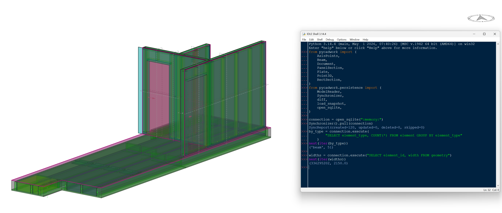

# pycadwork

**An object-oriented layer over [cwapi3d](https://pypi.org/project/cwapi3d/), the cadwork 3D Python API.**



`pycadwork` turns cadwork's flat, ID-and-controller-based API into a small,
typed, polymorphic object model. Instead of passing integer element IDs through
free functions on a dozen `*_controller` modules, you work with `Beam`, `Plate`,
`Drilling`, `Wall`, `Slab`, and `Roof` objects that carry their own geometry,
attributes, and behaviour — while every call to cadwork is funnelled through a
single, version-isolated seam.

```python
from pycadwork import Beam, Point3D, RectSection, AxisPoints

beam = Beam.create_rectangular(
    RectSection(width=120.0, height=240.0),
    AxisPoints(Point3D(0, 0, 0), Point3D(3000, 0, 0), Point3D(0, 0, 1)),
)
beam.attrs.material_name = "Pine"  # symmetric read/write properties
beam.attrs.group = "frame"

print(beam.geometry.length)  # live query against the model
print(beam.geometry.volume)
print(beam.cross_section)  # CrossSection.RECTANGULAR

beam.geometry.width = 100.0  # writes the real dimension back to the model
```

---

## Why this exists

cwapi3d is a thin binding over cadwork's C++ API. It is powerful but procedural:
everything is an `int` element ID, and behaviour lives in stateless controllers
(`element_controller`, `attribute_controller`, `geometry_controller`, …). Real
plugins end up threading raw IDs through helper functions and re-deriving an
element's "kind" by calling a battery of `is_*` predicates by hand.

`pycadwork` gives that surface an object model with four design commitments:

1. **One seam to cwapi3d.** Every cadwork call goes through
   `pycadwork.cadwork_adapter`. The rest of the package never imports `cadwork`
   or any `*_controller`. This isolates the entire codebase from any specific
   cwapi3d version — when the API moves, only the adapter changes.
2. **A uniform `Element` model.** Every wrapper inherits from one `Element` base.
   Aggregate APIs return `list[Element]`; you narrow by type with a generic
   helper (`group.members_of(Beam)`), never a `.beams` / `.plates` accessor.
3. **Real geometry value-types.** `Point3D`, `Vector3D`, `Frame3D`, bounding
   boxes, B-reps and a spatial index — proper objects with operators and
   methods, not bare tuples.
4. **Testable without cadwork.** The seam means the whole library runs against
   an in-memory fake. The suite (630 tests) needs no running cadwork process.

---

## Installation

`pycadwork` targets **Python 3.14+** and is managed with [uv](https://docs.astral.sh/uv/).

```bash
uv sync                 # install the library + dev dependencies
uv sync --extra cadwork # include the cwapi3d runtime dependency explicitly
```

Or with pip:

```bash
pip install -e .
```

> **Note** — `cwapi3d` only does real work inside a running cadwork 3D process.
> Outside cadwork (CI, local dev, tests) the library still imports and runs; you
> just swap the adapter for the in-memory fake.

Running pycadwork *inside* cadwork (the embedded interpreter, junction / `.pth`
linking, and installing native deps with `pip install --target`) is its own
topic — see **[docs/installation.md](docs/installation.md)**.

---

## Documentation

The full guide lives in [`docs/`](docs/):

| Topic | What's in it                                                                          |
|-------|---------------------------------------------------------------------------------------|
| [Installation](docs/installation.md) | Dev vs. cadwork-runtime setup, junctions, native deps, plugin projects                |
| [Architecture](docs/architecture.md) | The one-seam design, the layer diagram, and the package layout table                  |
| [The element model](docs/elements.md) | `Element`, `attrs` / `geometry` components, element types, `from_id`                  |
| [The document & project](docs/document.md) | `Document` as the live element repository and `ProjectInfo`                           |
| [Cover objects](docs/covers.md) | `Wall` / `Slab` / `Roof`, `CoverBuilder`, `discover_covers`                           |
| [Containers and MEP](docs/containers-mep.md) | `Container` containment, `CircularMep` / `RectangularMep`                             |
| [Geometry](docs/geometry.md) | `Point3D`, `Vector3D`, `Frame3D`, B-reps, bounding boxes, the R-tree index            |
| [Connectivity](docs/connectivity.md) | `find_connected`, `build_connection_graph` / `ConnectionGraph`                        |
| [Collision](docs/collision.md) | `check_collisions` — clash / contact / near-miss / clearance, `highlight_clashes`     |
| [Building & storey assignment](docs/building.md) | `StoreyAssigner` and the pure `StoreyStack`                                           |
| [Persistence](docs/persistence.md) | Mirror the model to normalized SQL and back — `pull` / `push`, gateways, `UnitOfWork` |
| [Reporting](docs/reporting.md) | `cutting_list`, `material_totals`, composable `by_*` dimensions                       |
| [Rules](docs/rules.md) | `check`, composable model-validation rules, `ElementRule` / `ModelRule`, severities |
| [Versioning](docs/versioning.md) | A git workflow over the `.3d/c` with diffable JSONL                                   |
| [Utilities](docs/utilities.md) | `DisplayRefreshScope`, `batch_apply`, `auto_*` decorators                             |
| [Testing](docs/testing.md) | The fake-adapter fixture and how to run the suite                                     |
| [Design principles](docs/design-principles.md) | The conventions that run through the whole codebase                                   |

The top-level namespace re-exports the full public surface, so you can write
`from pycadwork import Beam, Wall, CoverBuilder, Point3D` without knowing the
submodule layout.

Runnable examples live in [`examples/`](examples/).

---

## License & status

Early-stage (`0.1.0`). API is still settling. Licensed under the [MIT License](LICENSE).
