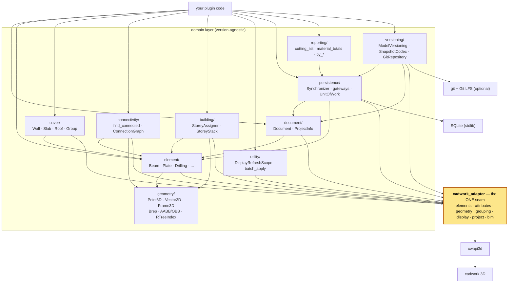

# Architecture

Everything above the seam is agnostic of any specific cwapi3d version. The
adapter is a facade of responsibility-scoped sub-adapters (`elements`,
`attributes`, `geometry`, `grouping`, `display`, `project`, `bim`); the only
stable types crossing the seam are the aliases and value objects in
`cadwork_adapter/types.py` (`ElementId`, `ElementTypeSnapshot`, `GroupingMode`,
`CoverKind`, …).

## Package layout

| Module                      | Responsibility                                                                                                                                                                                                                           |
|-----------------------------|------------------------------------------------------------------------------------------------------------------------------------------------------------------------------------------------------------------------------------------|
| `pycadwork.cadwork_adapter` | The single seam to cwapi3d. Responsibility-scoped sub-adapters (`elements`, `attributes`, `geometry`, `grouping`, `display`, `project`, `bim`) plus the stable types crossing it.                                                        |
| `pycadwork.document`        | `Document` — the project handle and live-query element repository — and `ProjectInfo`, the project-metadata read/write view.                                                                                                             |
| `pycadwork.element`         | Typed element wrappers — `Beam`, `Plate`, `Drilling`, `Node`, `Line`, `Surface`, `Opening`, `ConnectorAxis`, `AuxiliaryElement`, `CircularMep`, `RectangularMep` — plus the `Container` aggregate, the dispatch registry, and `from_id`. |
| `pycadwork.element.cover`   | Cover objects (`Wall`, `Slab`, `Roof`), the grouping-driven `Aggregate` base, `Group`, the fluent `CoverBuilder`, and `discover_covers`.                                                                                                 |
| `pycadwork.geometry`        | Pure geometry value-types: `Point3D`, `Vector3D`, `Frame3D`, `Plane3D`, `Line3D`, `Segment3D`, `Loop`, `Face`, `Brep`, AABB/OBB, the R-tree spatial index, and creation specs.                                                           |
| `pycadwork.connectivity`    | `find_connected` and `build_connection_graph` / `ConnectionGraph` — which elements touch or intersect, and the whole-model contact graph.                                                                                                |
| `pycadwork.building`        | `StoreyAssigner` and the pure `StoreyStack` — classify elements into a building's storeys from their vertical extent (BMT building/storey structure).                                                                                    |
| `pycadwork.utility`         | Cross-cutting helpers: `DisplayRefreshScope`, `batch_apply`, and `auto_*` decorators.                                                                                                                                                    |
| `pycadwork.persistence`     | Mirror the running model to a normalized SQL database and back — `Synchronizer` (`pull` / `push`), Table Data Gateways, a `UnitOfWork`, and frozen record DTOs.                                                                          |
| `pycadwork.reporting`       | Bill of materials over a `ModelSnapshot` — `cutting_list`, `material_totals`, composable `by_*` grouping dimensions, and CSV writers. Pure functions; works on a live read or a pulled SQL store.                                        |
| `pycadwork.rules`           | Validate a `ModelSnapshot` against declarative rules — `check`, composable built-in rule factories, `ElementRule` / `ModelRule`, severities, and a CSV writer. Pure functions reusing reporting's `SnapshotIndex`; works on a live read or a pulled SQL store. |
| `pycadwork.versioning`      | A git workflow over the model — `ModelVersioning` (commit / branch / checkout / restore / push / pull) committing both a diffable per-table JSONL serialization (`SnapshotCodec`) and the binary `.3d` / `.3dc` (Git LFS), behind a `Repository` seam (`GitRepository`, GitPython lazy-loaded via the optional `git` extra). |

The top-level namespace re-exports the full public surface, so you can write
`from pycadwork import Beam, Wall, CoverBuilder, Point3D` without knowing the
submodule layout.
