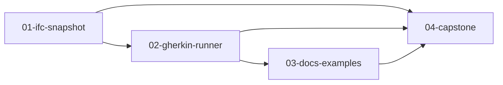

# Session Board: pycadwork — Gherkin live-model tests

**Source Spec:** `docs/spec/gherkin-live-model-tests.md`
**Source research:** `docs/research/gherkin-live-model-tests.md`
**Source architecture:** `docs/architecture/gherkin-live-model-tests.md`
**Source verification:** `docs/verification/gherkin-live-model-tests.md`
**Target repo:** `pycadwork`
**Human reviewers:** `n/a`
**Human signature:** `n/a`
**Target branch:** `feature/gherkin-live-model-tests` — plan-wide feature branch; created and **pushed to origin** by `/lp-to-session-seeds`. Per-seed work branches are each seed’s `**Branch:**` (user-confirmed, local only until you push).
**Source bugs:** `n/a`

## Kanban policies

- **WIP limit:** 1 (default)
- **Pull rule:** only pull a card whose `Blocked by` is empty/None AND lane WIP < limit
- **Definition of Ready:** seed complete, blockers Done
- **Definition of Done:** Acceptance criteria + Verification green, including **Runtime exercise**

## Lanes

- **L1:** [01-ifc-snapshot]
- **L2:** [02-gherkin-runner]
- **L3:** [03-docs-examples]
- **Lf1:** [04-capstone] — dedicated final lane for capstone

## Dependency graph

## Conflict-risk matrix

| Seed A | Seed B | Overlapping paths | Resolution |
|--------|--------|-------------------|------------|
| 01 | 02 | `src/pycadwork/__init__.py` (rule factories vs Gherkin exports) | serialise — 02 is `Blocked by` 01 |
| 01 | 03 | `docs/architecture.md`, `docs/rules.md` | serialise — 03 is `Blocked by` 02 (which is blocked by 01) |
| 02 | 03 | none expected (`src/pycadwork/gherkin/` + `tests/gherkin/` vs `docs/` + `examples/`) | serialise anyway — 03 imports a real `run_features` |
| 01–03 | 04 | n/a (capstone has no predicted paths) | capstone after all work seeds |

## Cards

| ID | Title | Type | Headless | Lane | Blocked by | Arch footprint | Status |
|----|-------|------|----------|------|------------|----------------|--------|
| 01 | IFC type on snapshot + rule factories | AFK | true | L1 | None — Ready | BimAdapter IFC, attrs.ifc_type, AttributeRecord + ADD COLUMN, fingerprint, ifc_type_is / material_is / count_is / all_of / named_equals | Done |
| 02 | Gherkin parser, compiler, run_features | AFK | true | L2 | 01-ifc-snapshot.md | pycadwork.gherkin, catalog, FeatureReport | Done |
| 03 | Module README, example feature, listings | AFK | true | L3 | 02-gherkin-runner.md | docs/gherkin.md, examples/gherkin.py, examples/features/framing.feature | Done |
| 04 | Capstone verification | AFK | true | Lf1 | 01-ifc-snapshot.md, 02-gherkin-runner.md, 03-docs-examples.md | Verification-only | Done |

Status ∈ {Backlog, Ready, In Progress, Done}.

## Revision log

(append-only; used by `/lp-revise`)

<!-- entries -->
