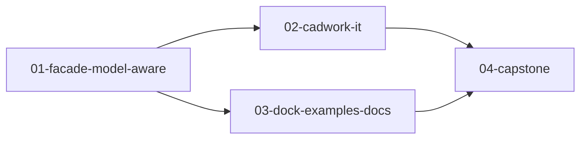

# Session Board: pycadwork — Git-like model versioning

**Source Spec:** `docs/spec/git-like-model-versioning.md`
**Source research:** `docs/research/git-like-model-versioning.md`
**Source architecture:** `docs/architecture/git-like-model-versioning.md`
**Source verification:** `docs/verification/git-like-model-versioning.md`
**Target repo:** `pycadwork`
**Human reviewers:** `n/a`
**Human signature:** `n/a`
**Target branch:** `feature/git-like-model-versioning` — plan-wide feature branch; created and **pushed to origin** by `/lp-to-session-seeds`. Per-seed work branches are each seed’s `**Branch:**` (user-confirmed, local only until you push).
**Source bugs:** `n/a`

## Kanban policies

- **WIP limit:** 1 (default)
- **Pull rule:** only pull a card whose `Blocked by` is empty/None AND lane WIP < limit
- **Definition of Ready:** seed complete, blockers Done
- **Definition of Done:** Acceptance criteria + Verification green, including **Runtime exercise**

## Lanes

- **L1:** [01-facade-model-aware, 02-cadwork-it]
- **L2:** [03-dock-examples-docs]
- **Lf1:** [04-capstone] — dedicated final lane for capstone

## Dependency graph

## Conflict-risk matrix

| Seed A | Seed B | Overlapping paths | Resolution |
|--------|--------|-------------------|------------|
| 01 | 02 | none expected (src vs tests/IT) | parallel OK after 01 Done |
| 01 | 03 | possibly `docs/versioning.md` only if 01 edits it | 01 owns library; 03 owns docs/examples — serialise docs if both need them (03 only) |
| 02 | 03 | none | parallel OK |

## Cards

| ID | Title | Type | Headless | Lane | Blocked by | Arch footprint | Status |
|----|-------|------|----------|------|------------|----------------|--------|
| 01 | Facade model-aware re-semantics + unit tests | AFK | true | L1 | None — Ready | ModelVersioning, DirtyWorkingTreeError, FakeRepository tests | Done |
| 02 | Cadwork run-program integration harness | AFK | true | L1 | 01 | IT host + in-cadwork script (terminal/launcher) | Done |
| 03 | Dock, examples, and versioning docs | AFK | true | L2 | 01 | examples + docs/versioning.md only | Done |
| 04 | Capstone verification | AFK | true | Lf1 | 01, 02, 03 | Verification-only | Done |

Status ∈ {Backlog, Ready, In Progress, Done}.

## Revision log

(append-only; used by `/lp-revise`)

<!-- entries -->
